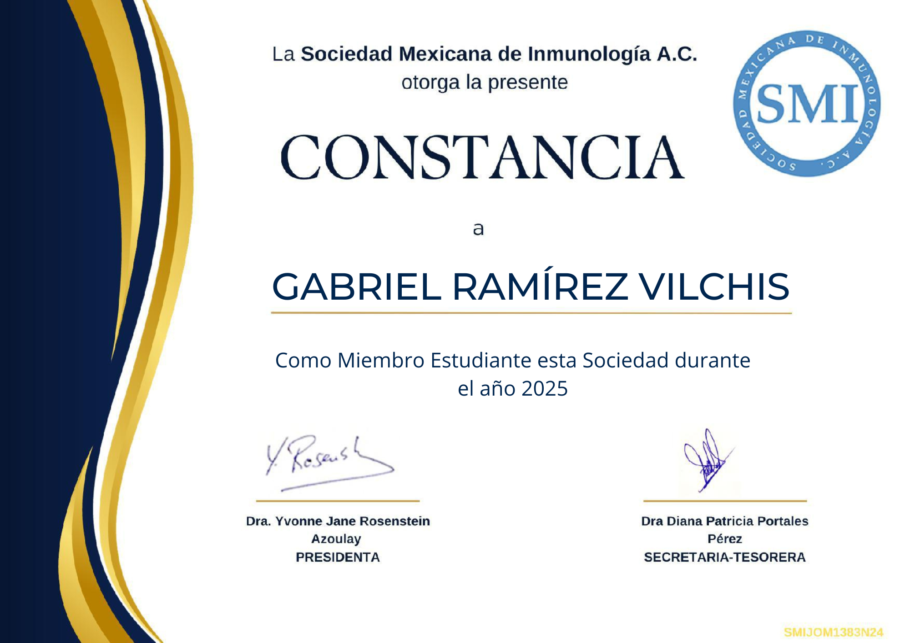

## _Available for a 12-month research placement (Aug 2026 – Jul 2027)_  
**Interests:** Immunology · Virology · Neuroscience · Machine Learning    

---

## About me    

I am an undergraduate student in [Genomic Sciences](https://www.lcg.unam.mx/) at the [National Autonomous University of Mexico (UNAM)](https://www.unam.mx/).  
My main interests include:  

- **Immunology** and host–virus interactions  
- **Erythropoiesis** and red blood cell development  
- **Bioinformatics & Genomics**, especially RNA-seq and computational analysis  

I aim to integrate experimental biology with computational approaches to better understand how cellular and viral processes are regulated at the molecular level.  

---

## Skills  

- **Programming & Data Analysis**: Python, R, Bash, C, Perl    
- **Bioinformatics**: BLAST, Clustal Omega, MUSCLE, RNA-seq preprocessing (FastQC, STAR, DESeq2)  
- **Collaborative Tools**: Git, GitHub, Jupyter Notebooks  
- **Molecular Biology**: Microscopy, flow cytometry (basic level)  
- **Languages**: Spanish (Native), English (C1), French (A2)  
- **Soft Skills**: Teamwork, problem-solving, adaptability, communication  

---

## Research Experiences  

**Lieber Institute for Brain Development (LIBD), Baltimore, MD, USA**  
*[Leonardo Collado-Torres Lab](https://lcolladotor.github.io/)* | *Research Intern (Remote)*  
*Jun 2025 – Present*  

- Analysis of transcriptomic data with R/Bioconductor.  
- Development of reproducible pipelines for large-scale data analysis.  

**Institute of Biotechnology (IBt), Morelos, Mexico**  
*[Yvonne Rosenstein-Azoulay Lab](https://www.ibt.unam.mx/agrupacion/direccion-22/departamento-de-medicina-molecular-y-bioprocesos-52/grupo-de-la-dra-yvonne-rosenstein-14)* | *Research Intern*  
*Dec 2024 – Present*  

- Studying the process of nuclear extrusion during erythroid differentiation.  
- Laboratory techniques in molecular biology and microscopy.  

**Center for Genomic Sciences (CCG), Morelos, Mexico**  
*[FreyreLab](http://freyrelab.org/en/)* | *Undergraduate Student*  
*Dec 2021 - Jul 2022*

- Learning Python for data analysis.  
- Parsing data from HTML files and performed basic analyses.  

---

## Teaching Experiences  

**National Autonomous University of Mexico (UNAM)**  
*[Undergraduate Program in Genomic Sciences (LCG)](https://www.lcg.unam.mx/)* | *Teaching Assistant*  
*Aug 2025 – Present*  

- Assisting in the course _"Introduction to Probability and Statistics"_.  

---

## Publications & Presentations  

- **Role of CD43 in erythroid differentiation**  
  Poster presented at **_XXVI National Congress of Immunology_, Chihuahua, Mexico**, 2025  
  **Authors:** Gabriel Ramírez-Vilchis, Samantha Carpio-Torres, Ángel Flores-Alcantar, Erika Melchy-Pérez, Verónica Rojo-León & Yvonne Rosenstein.  
  [🔗 View Certificate (PDF)](Poster_constancia_Chihuahua2025.pdf)  

  

---

## Education  

**B.Sc. in Genomic Sciences (ongoing)**  
_[National Autonomous University of Mexico (UNAM)](https://www.lcg.unam.mx/)_  
*Aug 2021 – Present*  

**High School**  
_[National High School "Miguel E. Schulz", UNAM](https://prepa8.unam.mx/p8/)_  
*Aug 2018 – Jul 2021*  

---

## Courses & Training  

- **Fundamental Concepts in Immunology** - *Mexican Society for Immunology (SMI), Mexico, 2025*  
[🔗 View Certificate (PDF)](ImmunologyCourse2025.pdf)  

- **Flow Cytometry for Leukemia Immunophenotyping** — *National Cytometry Laboratory (LabNalCit), Mexico, 2025*    
[🔗 View Certificate (PDF)](FlowCytometry2025.pdf)   

---

## Memberships & Affiliations  

- Student member, _Mexican Society for Immunology (SMI)_   
  

  

---

## Awards & Recognitions
- **3rd Place – XXIX University Science, Technology and Innovation Fair** | UNAM, 2021  
  Project: *Observing and analyzing human nonverbal communication: smiles as a form of communication*  
  [🔗 View Project (PDF)](ScienceFair2021.pdf)  
- **1st Place – Inter-preparatories Chemistry Contest** | National High School 8, UNAM, 2020  
- **3rd Place – University Knowledge Olympiad (Mathematics)** | UNAM, 2019  
- **2nd Place – Inter-preparatories Math Contest** | National High School, UNAM, 2019

---

## GitHub Activity  

### Stats  

  

  

### Top Languages   

  

 

### Contribution Streak  

  

   

### Tools & Technologies  

  

---

## Academic Posts (BlueSky)

<bsky-embed username="gabrielramirezv.bsky.social" limit="2"></bsky-embed>  

---

## Beyond the Lab  

Outside of research, I enjoy practicing **Mexican folklore dance**, **swimming**, and spending time with **family and friends**.  
I also served as a **full-time missionary** for [The Church of Jesus Christ of Latter-day Saints](https://www.churchofjesuschrist.org/), where I developed leadership, teamwork, and problem-solving skills.  

  
  
  
  

---
